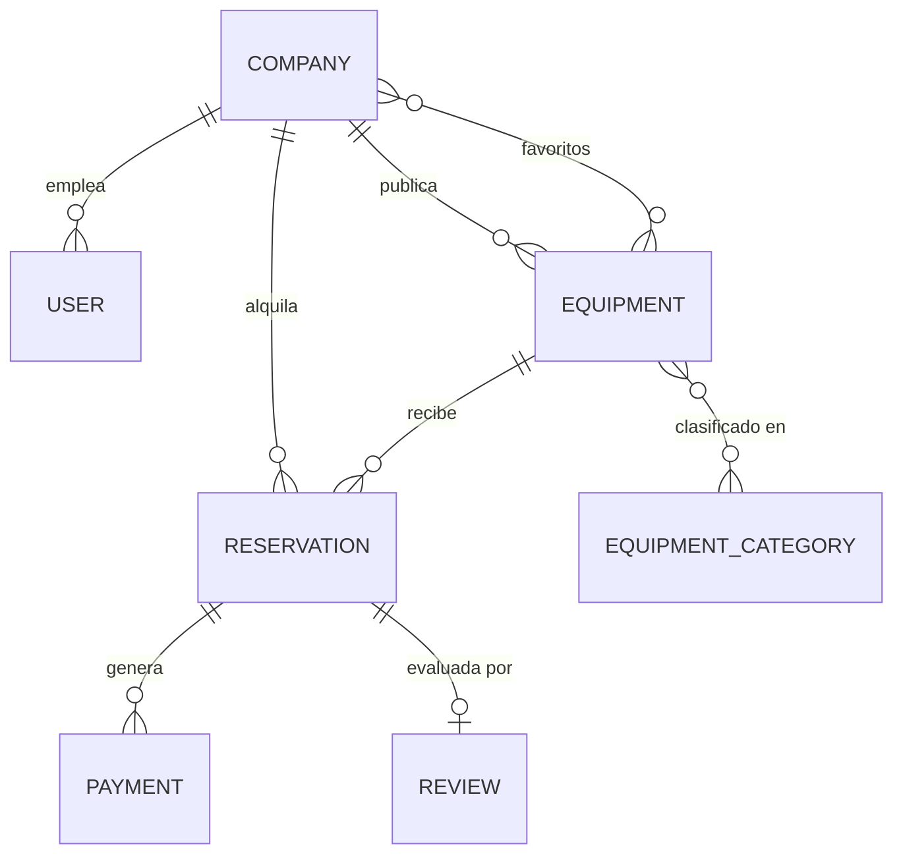

# RentEquip — Marketplace B2B de Alquiler de Maquinaria de Construcción

**Curso:** CS 2031 — Desarrollo Basado en Plataforma<br>
**Docente:** Yarasca Moscol, Julio Eduardo<br>
**Lima, Perú — 2026**

**Integrantes:**

| Integrante | Código |
|---|---|
| Ayala Vega, Valeria | 202310180 |
| Cadenas Hidalgo, Anthony Darían | 202510031 |
| Ramos Calderón, Mary Sofía | — |
| Rodrigo Corzo, Ernesto | 202310441 |
| Rojas Llanos, Sergio | 202410758 |

**Repositorio:** https://github.com/sergio453LOL/ProyectoBackend<br>
**Deployment:** _pendiente (ver [Estado de la entrega](#estado-de-la-entrega))_

---

## Índice

1. [Introducción](#1-introducción)
2. [Identificación del Problema o Necesidad](#2-identificación-del-problema-o-necesidad)
3. [Descripción de la Solución](#3-descripción-de-la-solución)
4. [Modelo de Entidades](#4-modelo-de-entidades)
5. [API REST y Endpoints](#5-api-rest-y-endpoints)
6. [Manejo de Errores](#6-manejo-de-errores)
7. [Medidas de Seguridad Implementadas](#7-medidas-de-seguridad-implementadas)
8. [Eventos y Asincronía](#8-eventos-y-asincronía)
9. [Instalación y Ejecución Local](#9-instalación-y-ejecución-local)
10. [GitHub & Management](#10-github--management)
11. [Conclusión](#11-conclusión)
12. [Apéndices](#12-apéndices)

> [Estado de la entrega](#estado-de-la-entrega) — resumen de lo implementado y lo pendiente.

---

## 1. Introducción

### Contexto

El sector construcción peruano está dominado por contratistas pequeños y medianos que operan por proyecto. Cada obra exige un parque de maquinaria distinto y, una vez terminada, ese equipo queda inmovilizado en un almacén hasta el siguiente contrato. El resultado es un mercado con capital ocioso de un lado y demanda insatisfecha del otro, sin canal formal que los conecte.

### Objetivos del Proyecto

- **Publicar** maquinaria en desuso con especificaciones, tarifas, ubicación y estado.
- **Buscar por proximidad** (coordenadas + radio), filtrando por categoría, ciudad, tarifa y ventana de fechas libre.
- Garantizar mediante un **flujo transaccional** que dos empresas jamás obtengan la misma máquina en fechas superpuestas, incluso bajo peticiones simultáneas.
- Modelar el **ciclo de vida** de la reserva con reglas explícitas sobre quién ejecuta cada transición.
- Cerrar el ciclo con **reseñas verificadas** y proteger todo con **autenticación JWT y roles**.

## 2. Identificación del Problema o Necesidad

### Descripción del Problema

Un contratista que necesita una retroexcavadora por doce días puede comprarla (capital muerto entre obra y obra) o alquilarla a un proveedor tradicional a tarifas que asumen intermediación. Mientras tanto, otra constructora a quince kilómetros tiene esa misma máquina parada. No existe canal que los conecte porque el alquiler entre empresas exige resolver tres problemas: saber **qué hay cerca**, **si está libre en las fechas exactas** y garantizar que la reserva sea **firme**.

### Justificación

El tercero es el que convierte esto en un problema de backend y no de catálogo. Si dos contratistas reservan la misma excavadora para la misma semana, alguien llega a la obra y la máquina no está. Entre el "está libre" y el "reservado" hay una ventana por la que otra petición puede colarse, así que tratamos el overbooking como una invariante de base de datos, no como una validación de formulario.

## 3. Descripción de la Solución

### Funcionalidades Implementadas

**Gestión de empresas y usuarios.** Alta de empresas con RUC y email únicos; cada una agrupa usuarios con tres roles (`ADMIN`, `MANAGER`, `OPERATOR`). Las contraseñas se guardan con BCrypt y nunca salen en las respuestas. Una regla impide dejar a una empresa sin administrador, y la baja es lógica para preservar el historial.

**Catálogo de maquinaria.** Marca, modelo, año, serie única, tarifas, depósito, imágenes y ubicación. Cada equipo admite múltiples categorías (N:M).

**Búsqueda por proximidad.** `GET /api/v1/equipment/search` implementa Haversine en JPQL: calcula kilómetros entre el origen y cada equipo, filtra por radio y **ordena por cercanía**. Los demás filtros son opcionales; `null` desactiva el predicado. Con fechas, un `NOT EXISTS` excluye los equipos con reservas solapadas, así el catálogo solo muestra lo reservable.

**Reservas sin overbooking.** El núcleo del proyecto. Al crear una reserva, el servicio abre una transacción `READ_COMMITTED` y lo primero que hace es tomar un **lock pesimista** (`SELECT ... FOR UPDATE`, timeout de 5 s) sobre la fila del equipo. Ese lock es el punto de serialización: dos peticiones concurrentes se encolan ahí, así que la comprobación de solapamiento nunca corre en paralelo. Bloquear la tabla de reservas no bastaría, porque **las filas que todavía no existen no se pueden bloquear**. Con el lock tomado se valida el rango de fechas, que el equipo sea alquilable, que el arrendatario no sea el dueño y que no haya solapamiento; recién entonces se inserta. La segunda petición recibe `409 OVERBOOKING`.

**Ciclo de vida de la reserva.** `ReservationStatusPolicy` concentra la máquina de estados (`PENDING → CONFIRMED → IN_PROGRESS → COMPLETED`, con `CANCELLED` y `REJECTED` como salidas) y quién puede activar cada transición: confirmar, rechazar, iniciar y completar son del dueño; cancelar, de ambas partes. Al confirmar se revalida la disponibilidad bajo lock y el estado del equipo se sincroniza solo.

**Reseñas verificadas.** Solo el arrendatario de una reserva `COMPLETED` puede reseñarla, y solo una vez. **Extras:** paginación en todos los listados, Swagger UI, logging con SLF4J y Docker Compose.

### Tecnologías Utilizadas

| Capa | Tecnología |
|---|---|
| Lenguaje | Java 21 |
| Framework | Spring Boot 4.1.1 (Web MVC, Data JPA, Security, Validation) |
| Persistencia | PostgreSQL 16 + Hibernate |
| Documentación | springdoc-openapi 3.1.0 (Swagger UI) |
| Testing | JUnit 5, Spring Boot Test, AssertJ, H2 en modo PostgreSQL |
| Build | Maven (wrapper incluido) |
| Contenedores | Docker + Docker Compose |
| Utilidades | Lombok, SLF4J |

## 4. Modelo de Entidades



**Descripción de entidades.** Todas heredan de `BaseEntity`: `id` autogenerado, `createdAt`/`updatedAt` de Hibernate y un `equals`/`hashCode` seguro frente a proxies Lazy.

- **Company** — empresa del marketplace; actúa como arrendadora y arrendataria. RUC y email únicos, coordenadas validadas.
- **User** — persona que opera en nombre de una empresa. Email único, contraseña BCrypt, rol enumerado.
- **Equipment** — maquinaria publicada. Serie única, tarifas `DECIMAL(12,2)`, estado (`AVAILABLE`, `RENTED`, `MAINTENANCE`, `INACTIVE`), ubicación indexada por `(latitude, longitude)` e imágenes como `@ElementCollection`.
- **EquipmentCategory** — taxonomía del catálogo, con nombre único.
- **Reservation** — contrato temporal. Guarda la tarifa y el depósito **congelados al momento de reservar**, de modo que un cambio de precio posterior no altere reservas existentes. Índice compuesto `(equipment_id, start_date, end_date)` y `@AssertTrue` que impide rangos invertidos.
- **Payment** — pagos de la reserva (`RENTAL`, `SECURITY_DEPOSIT`, `REFUND`) con estado y referencia externa única; la integración con la pasarela es Fase 2.
- **Review** — reseña 1:1 con la reserva, con unicidad en columna.

**Decisiones de diseño.** Las relaciones `@ManyToOne` son `LAZY`, con `JOIN FETCH` explícito solo donde el DTO necesita el grafo. El cascade es `ALL` de empresa a usuarios, pero solo `PERSIST/MERGE` hacia equipos y reservas: borrar una empresa no debe borrar historial.

## 5. API REST y Endpoints

Todos los recursos cuelgan de `/api/v1/`, en plural, con verbos HTTP semánticos y `ResponseEntity` explícito. Documentación interactiva en `http://localhost:8080/swagger-ui.html`.

| Recurso | Endpoints |
|---|---|
| Autenticación | `POST /auth/register` · `POST /auth/login` · `POST /auth/refresh` (públicos) |
| Empresas | `POST /companies` · `GET /companies` · `GET /companies/{id}` · `PATCH /companies/{id}` · `DELETE /companies/{id}` · `GET /companies/{id}/users` · `GET /companies/{id}/equipment` |
| Usuarios | `POST /users` · `GET /users/{id}` · `PATCH /users/{id}` · `DELETE /users/{id}` |
| Categorías | `POST /equipment-categories` · `GET /equipment-categories` · `GET /{id}` · `PUT /{id}` · `DELETE /{id}` |
| Maquinaria | `POST /equipment` · `GET /equipment/{id}` · `PATCH /equipment/{id}` · `DELETE /equipment/{id}` · `GET /equipment/search` · `GET /equipment/{id}/reservations` · `GET /equipment/{id}/reviews` |
| Reservas | `POST /reservations` · `GET /reservations` · `GET /reservations/{id}` · `PATCH /reservations/{id}/status` · `POST /reservations/{id}/confirmation` · `POST /reservations/{id}/cancellation` · `GET /reservations/availability` |
| Reseñas | `POST /reviews` · `GET /reviews/{id}` · `GET /reviews?reservationId=` · `GET /reviews/ratings` · `DELETE /reviews/{id}` |

Códigos utilizados: `200` en lecturas y actualizaciones, `201` con cabecera `Location` en creaciones, `204` en bajas, `400` en validación, `401` sin token válido, `403` por rol insuficiente o recurso ajeno, `404` cuando no existe, `409` en conflictos (duplicados, overbooking, transición inválida) y `500` como red de seguridad.

**Hipermedia.** Las respuestas individuales de empresas, maquinaria y reservas viajan envueltas en un `EntityModel` y llevan sus enlaces en `_links`: `self` más las colecciones que cuelgan del recurso. En una reserva, además, los enlaces de transición **dependen de su estado**: `confirmation` y `cancellation` solo aparecen cuando la máquina de estados permite esa transición, de modo que el cliente descubre lo que puede hacer leyendo la respuesta en vez de replicar las reglas. Los enlaces se construyen en ensambladores dedicados (`hateoas/`), no en los controladores, que siguen limitándose a delegar.

## 6. Manejo de Errores

Toda excepción de dominio hereda de `RentEquipException`, que transporta su propio `HttpStatus` y un código legible por máquina. Sobre esa jerarquía hay nueve excepciones especializadas: `ResourceNotFoundException`, `DuplicateResourceException`, `InvalidOperationException`, `UnauthorizedException`, `ForbiddenOperationException`, `OverbookingException`, `EquipmentUnavailableException`, `InvalidReservationDateException` e `InvalidStatusTransitionException`.

`GlobalExceptionHandler` (`@RestControllerAdvice`) es el único punto donde una excepción se convierte en respuesta HTTP. Además del dominio propio captura las de Spring: validación de cuerpo y parámetros (con la lista de campos inválidos), JSON malformado, `DataIntegrityViolationException` → 409, fallos de lock → 409 con `CONCURRENT_REQUEST`, y un `Exception` final que registra el stacktrace pero devuelve un mensaje genérico.

El cuerpo es siempre el mismo `ErrorResponse`: `timestamp`, `status`, `error`, `code`, `message`, `path` y `details`. Centralizarlo permite que el cliente parsee una sola forma de error y que los detalles internos nunca salgan (`server.error.include-stacktrace=never`).

## 7. Medidas de Seguridad Implementadas

**Seguridad de datos.** Las contraseñas se cifran con BCrypt y ningún DTO de respuesta expone el campo. Los DTOs son el límite del sistema: las entidades JPA nunca se serializan, lo que elimina fugas al añadir campos. Credenciales y claves salen de variables de entorno, y `.env` está en `.gitignore` y `.dockerignore`.

**Prevención de vulnerabilidades.** Contra **inyección SQL**, todo el acceso a datos pasa por Spring Data JPA con consultas parametrizadas (`@Param`); no hay concatenación de strings en ninguna query. Contra **XSS**, la API responde exclusivamente JSON y `spring.web.resources.add-mappings=false` desactiva el servido de estáticos. Contra **CSRF**, la protección se desactiva deliberadamente porque la sesión es `STATELESS`: no hay cookie que un tercero pueda reutilizar. **CORS** está restringido por patrón de origen (`localhost` y `*.vercel.app`). La validación opera en dos capas: `@Valid` sobre los DTOs y constraints de columna en las entidades, de forma que ni una escritura directa pueda violar las invariantes.

**Autenticación con JWT.** `POST /api/v1/auth/register` da de alta una empresa y su administrador en una sola transacción; `POST /api/v1/auth/login` devuelve access token y refresh token firmados con HMAC-SHA256, con los claims `userId`, `email`, `companyId` y `role`. `JwtAuthenticationFilter`, un `OncePerRequestFilter`, extrae el token de `Authorization: Bearer`, lo valida y puebla el `SecurityContext`; si falta o es inválido el `AuthenticationEntryPoint` responde 401 con el mismo `ErrorResponse` del resto de la API. La clave se lee de `JWT_SECRET`. `POST /api/v1/auth/refresh` recarga al usuario desde la base de datos en lugar de confiar en el token, para que una baja o un cambio de rol surtan efecto de inmediato.

**Autorización en dos niveles.** El rol se comprueba con `@PreAuthorize` en los métodos sensibles de los controladores (`@EnableMethodSecurity` activo): `ADMIN` gestiona usuarios y empresa, `ADMIN` y `MANAGER` publican maquinaria y confirman reservas, y cualquier autenticado puede reservar y reseñar. La pertenencia del recurso se verifica aparte, en la capa de servicio, que lee la identidad del `SecurityContext` mediante el componente `CurrentUser` y responde 403 ante un recurso ajeno. Son dos preguntas distintas y se responden en capas distintas.

La empresa arrendataria de una reserva **nunca viaja en el cuerpo de la petición**: sale del token. De otro modo, cualquier usuario autenticado podría reservar maquinaria a nombre de otra empresa.

## 8. Eventos y Asincronía

La concurrencia crítica se resolvió de forma **deliberadamente sincrónica**: disponibilidad e inserción ocurren en una sola transacción con lock pesimista, porque el usuario necesita saber en la misma respuesta si obtuvo la máquina.

La asincronía corresponde al trabajo posterior, y está diseñada sobre `@TransactionalEventListener(AFTER_COMMIT)` para tres casos: reserva creada, confirmada y cancelada. Publicar tras el commit evita anunciar por correo una reserva que luego hizo rollback, y `@Async` impide que la latencia del SMTP se sume al tiempo de respuesta. **Estado: `spring-boot-starter-mail` está declarado; los listeners y el `ThreadPoolTaskExecutor` siguen pendientes.**

## 9. Instalación y Ejecución Local

**Requisitos:** Docker Desktop. (JDK 21 solo si se ejecuta desde el IDE.)

```bash
git clone https://github.com/sergio453LOL/ProyectoBackend.git
cd ProyectoBackend
docker compose up -d --build
```

Swagger UI queda en `http://localhost:8080/swagger-ui.html`, con botón *Authorize* para pegar el token. Para detener: `docker compose down` (`-v` borra también los datos). La guía detallada está en [`GUIA_LEVANTAR_PROYECTO.md`](GUIA_LEVANTAR_PROYECTO.md). Las 19 pruebas se ejecutan con `./mvnw test` sobre H2, sin contenedores.

**Variables de entorno:**

| Variable | Valor por defecto | Descripción |
|---|---|---|
| `DB_URL` | `jdbc:postgresql://localhost:5432/rentequip` | Cadena de conexión |
| `DB_USERNAME` | `postgres` | Usuario de base de datos |
| `DB_PASSWORD` | `postgres` | Contraseña |
| `DDL_AUTO` | `update` | Estrategia de esquema de Hibernate |
| `PORT` | `8080` | Puerto del servidor |
| `JWT_SECRET` | clave de desarrollo | Clave de firma de los tokens, mínimo 32 bytes. **Obligatorio en producción** |
| `JWT_ACCESS_MINUTES` | `60` | Vigencia del access token |
| `JWT_REFRESH_DAYS` | `7` | Vigencia del refresh token |

## 10. GitHub & Management

El trabajo se organiza en `sergio453LOL/ProyectoBackend` con Conventional Commits que agrupan una capa por commit (`feat(domain)`, `feat(persistence)`, `feat(security)`, `test`), de modo que el historial se lee como la construcción incremental de la arquitectura. El trabajo se reparte en ramas de feature descritas en `docs/agents/`, cada una dueña de un conjunto de archivos para evitar colisiones. El `.gitignore` excluye `target/`, `.env` y la configuración del IDE: no hay credenciales en el historial.

**Pendiente:** el tablero de GitHub Projects con issues, labels y milestones, y el workflow de GitHub Actions. El flujo previsto es un job que ejecute `./mvnw -B verify` en cada push y pull request a `main` —con PostgreSQL como service container— y otro que construya la imagen Docker al mergear, para que ningún cambio que rompa las pruebas de concurrencia llegue a la rama principal.

## Estado de la entrega

| | |
|---|---|
| **Implementado** | 7 entidades JPA · 24 DTOs + 7 mappers · Controller→Service→Repository · 9 excepciones + handler global · 7 controladores `/api/v1` · reserva con lock pesimista probada bajo concurrencia autenticada · búsqueda geoespacial paginada · JWT con refresh y roles con `@PreAuthorize` · HATEOAS · 19 pruebas en verde · Swagger con Bearer, Docker Compose, SLF4J |
| **Pendiente** | eventos `@Async` + servicio de correo · deployment · GitHub Actions · GitHub Projects |

## 11. Conclusión

### Logros del Proyecto

El backend resuelve lo que identificamos como más difícil en la propuesta: **la disponibilidad bajo concurrencia**. `ReservationConcurrencyTest` lanza diez peticiones autenticadas simultáneas sobre la misma máquina y el mismo rango, y verifica que exactamente una sobreviva. También quedó resuelta la búsqueda por proximidad con ordenamiento por distancia, la otra incógnita técnica que declaramos al inicio. Sobre esa base se cerró el módulo de seguridad: autenticación con JWT, autorización por rol y aislamiento entre empresas, todo cubierto por pruebas de extremo a extremo.

### Aprendizajes Clave

El aprendizaje central fue entender *dónde* colocar un lock. La primera intuición —bloquear las reservas existentes— es insuficiente, porque el conflicto lo produce una fila que aún no existe; bloquear la fila del equipo convierte el recurso disputado en el punto de serialización. También aprendimos que `@Transactional` no es magia: importan la isolation, el orden de las operaciones y que el lock se tome *antes* de leer aquello sobre lo que se decide.

### Trabajo Futuro

Implementar los listeners transaccionales de correo con plantillas Thymeleaf; persistir los refresh tokens para poder revocarlos; migrar de `ddl-auto=update` a Flyway antes de producción; reemplazar Haversine en JPQL por PostGIS con índices GiST cuando el catálogo crezca; integrar Stripe para pagos y depósitos; y subir imágenes a S3 de forma asíncrona.

## 12. Apéndices

### Licencia

Proyecto académico desarrollado para el curso CS 2031, distribuido bajo licencia MIT.

### Referencias

- [Spring Boot Reference Documentation](https://docs.spring.io/spring-boot/index.html)
- [Spring Data JPA — Locking](https://docs.spring.io/spring-data/jpa/reference/jpa/locking.html)
- [PostgreSQL 16 — Explicit Locking](https://www.postgresql.org/docs/16/explicit-locking.html)
- [Jakarta Bean Validation](https://jakarta.ee/specifications/bean-validation/3.0/)
- [springdoc-openapi](https://springdoc.org/)
- [Conventional Commits](https://www.conventionalcommits.org/)
